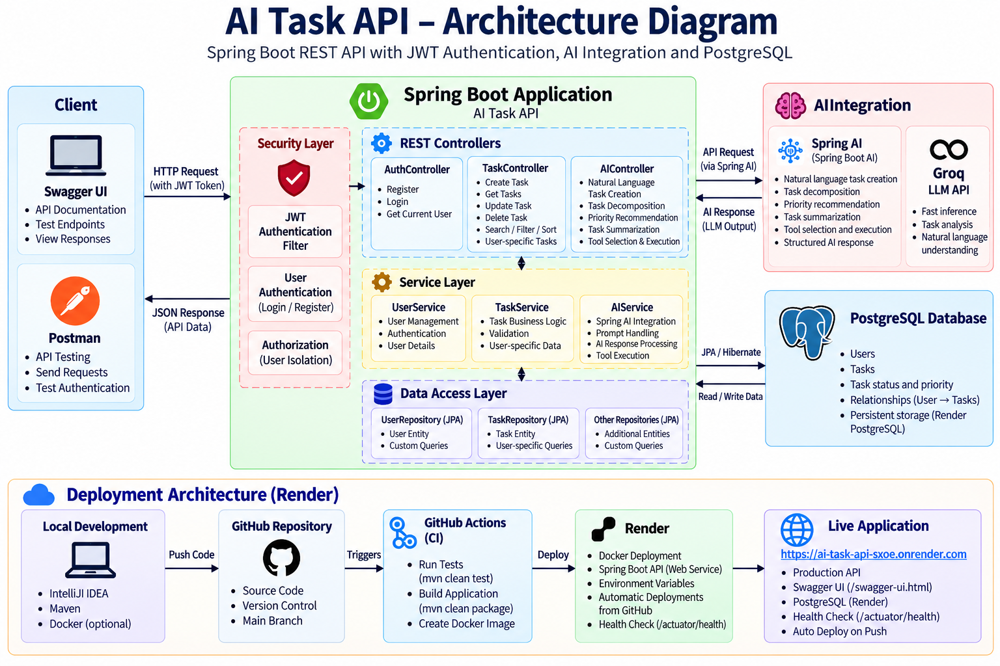

# AI Task API


A production-oriented task management REST API built with Java and Spring Boot, featuring JWT authentication, user-specific authorization, PostgreSQL persistence, Docker deployment, and AI-powered task operations using Spring AI and Groq.

## Why This Project

This project was built to go beyond basic CRUD operations and explore how AI can be integrated into a real backend application while keeping business logic, validation, authorization, and database operations under application control.

The main focus was designing a clear boundary between LLM-driven intent interpretation and deterministic application logic. AI features such as natural-language task creation, task decomposition, priority recommendation, summarization, and tool calling produce structured outputs that are validated before being passed to the application service layer.

The project also combines these AI capabilities with a properly secured Spring Boot backend using JWT authentication, user-specific authorization, PostgreSQL persistence, automated testing, and Docker-based deployment.

The goal was to build an AI-native backend that demonstrates not only how to integrate an LLM, but also how to integrate it safely into a conventional software architecture.

## Table of Contents

- [Features](#features)
- [Architecture](#architecture)
- [AI Safety Boundary](#ai-safety-boundary)
- [Technology Stack](#technology-stack)
- [Project Structure](#project-structure)
- [API Documentation](#api-documentation)
- [Running Locally](#running-locally)
- [Running with Docker](#running-with-docker)
- [Authentication Flow](#authentication-flow)
- [Task API](#task-api)
- [AI API](#ai-api)
- [Testing](#testing)
- [Configuration](#configuration)
- [Production Considerations](#production-considerations)
- [Future Improvements](#future-improvements)
- [Author](#author)

## Features

### Task Management

- Create, read, update, and delete tasks
- Task status management
- Task priority management
- Due dates
- Pagination
- Sorting
- Filtering by status and priority
- Keyword search
- User-specific task ownership and authorization

### Authentication & Security

- User registration
- User login
- BCrypt password hashing
- JWT-based authentication
- Stateless security
- User-specific task authorization
- Protected API endpoints
- Public authentication and API documentation endpoints

### AI Features

The application uses Spring AI's OpenAI-compatible integration with Groq as the LLM provider.

#### Natural Language Task Creation

Create tasks using natural language.

Example prompt:

> Create a high-priority task to prepare for my Spring Boot interview tomorrow.

The AI extracts:

- Task title
- Description
- Priority
- Due-date expression

The application then validates the AI output and delegates task creation to the normal task service.

#### AI Task Decomposition

Break a larger task into actionable subtasks.

Example prompt:

> Prepare for my Spring Boot interview.

The AI generates a structured list of subtasks which are validated before being created.

#### AI Priority Recommendation

Ask the AI to recommend a priority for an existing task based on:

- Task title
- Description
- Due date
- Urgency
- Importance

The recommendation can also be applied through the API.

#### AI Task Summarization

Generate a structured summary containing:

- Summary
- Key points
- Next action

The AI is instructed not to invent information that is not present in the task.

#### AI Tool Calling

Natural-language commands can be converted into validated application commands.

Currently supported operations include:

- `UPDATE_TASK_STATUS`
- `UPDATE_TASK_PRIORITY`

The AI does not directly modify the database. It produces a structured command which is validated and executed by the application service layer.

## Architecture



The application follows a layered Spring Boot architecture with JWT-based authentication, user-specific authorization, PostgreSQL persistence, and an AI orchestration layer using Spring AI and Groq.

The LLM is responsible for interpreting user intent and producing structured output. Application services remain responsible for validation, authorization, business rules, and database mutations.

## AI Safety Boundary

The application enforces a strict separation between AI interpretation and application state changes. The LLM never has direct access to the database.

```text
Natural Language
       |
       v
      LLM
       |
       v
Structured Command
       |
       v
   Validation
       |
       v
Application Service
       |
       v
    Database
```

The LLM is responsible for interpreting user intent only. Validation, authorization, business rules, and database mutations remain fully under application control.

## Technology Stack

| Technology              | Purpose                          |
|--------------------------|-----------------------------------|
| Java                     | Programming language              |
| Spring Boot              | Backend framework                 |
| Spring Web               | REST API                          |
| Spring Data JPA          | Persistence                       |
| Hibernate                | ORM                                |
| PostgreSQL               | Relational database               |
| Spring Security          | Authentication and authorization  |
| JWT                      | Stateless authentication          |
| BCrypt                   | Password hashing                  |
| Spring AI                | AI integration                    |
| Groq                     | LLM provider                      |
| Swagger / OpenAPI        | API documentation                 |
| Spring Boot Actuator     | Health monitoring                 |
| Maven                    | Build and dependency management   |
| Docker                   | Application containerization      |
| Docker Compose           | Multi-container deployment        |
| JUnit                    | Testing                           |

## Project Structure

```text
src/
├── main/
│   ├── java/
│   │   └── com/sooraj/aitaskapi/
│   │       ├── config/
│   │       ├── controller/
│   │       ├── dto/
│   │       ├── entity/
│   │       ├── exception/
│   │       ├── repository/
│   │       ├── security/
│   │       ├── service/
│   │       └── specification/
│   │
│   └── resources/
│       └── application.properties
│
└── test/
    ├── java/
    └── resources/
```

## API Documentation

When the application is running:

| Resource | URL |
|---|---|
| Swagger UI | http://localhost:8080/swagger-ui/index.html |
| OpenAPI Specification | http://localhost:8080/v3/api-docs |
| Health Check | http://localhost:8080/actuator/health |

Example health response:

```json
{
  "groups": [
    "liveness",
    "readiness"
  ],
  "status": "UP"
}
```

## Running Locally

### Prerequisites

- Java 25+
- Maven
- PostgreSQL 18+
- Groq API key

### Environment Variables

Create a `.env` file containing:

```env
DB_USERNAME=postgres
DB_PASSWORD=your_database_password

JWT_SECRET=your_jwt_secret
JWT_EXPIRATION=3600000

GROQ_API_KEY=your_groq_api_key
GROQ_MODEL=openai/gpt-oss-20b
```

Do not commit `.env` to Git. A `.env.example` file is included as a safe template.

### Database

Create a PostgreSQL database:

```sql
CREATE DATABASE ai_task_db;
```

The local configuration expects PostgreSQL on `localhost:5433`.

### Run the Application

Load the environment variables and start the application:

```bash
mvn spring-boot:run
```

The API will be available at `http://localhost:8080`.

## Running with Docker

Build the application:

```bash
mvn clean package -DskipTests
```

Build the Docker image:

```bash
docker build -t ai-task-api .
```

Start the application and PostgreSQL:

```bash
docker compose up -d
```

Check the containers:

```bash
docker compose ps
```

Stop the containers:

```bash
docker compose down
```

### Docker Architecture

```text
                Docker Compose
                     |
          +----------+----------+
          |                     |
          v                     v
   ai-task-api             PostgreSQL 18
      :8080                    :5432
          |                     |
          +----------+----------+
                     |
               postgres_data
                  volume
```

PostgreSQL data is stored in a Docker named volume.

## Authentication Flow

### Register

```http
POST /api/auth/register
Content-Type: application/json

{
  "name": "John Doe",
  "email": "john@example.com",
  "password": "Password@123"
}
```

### Login

```http
POST /api/auth/login
Content-Type: application/json

{
  "email": "john@example.com",
  "password": "Password@123"
}
```

The login response provides a JWT token. Use it for protected endpoints:

```http
Authorization: Bearer <JWT_TOKEN>
```

## Task API

| Method | Endpoint | Description |
|---|---|---|
| GET | `/api/tasks` | List tasks (supports search, filtering, pagination, sorting) |
| POST | `/api/tasks` | Create a task |
| GET | `/api/tasks/{id}` | Get a task by ID |
| PUT | `/api/tasks/{id}` | Update a task |
| PATCH | `/api/tasks/{id}/status` | Update task status |
| DELETE | `/api/tasks/{id}` | Delete a task |

Example — listing tasks with pagination and sorting:

```http
GET /api/tasks?page=0&size=10&sort=createdAt,desc
```

## AI API

| Method | Endpoint | Description |
|---|---|---|
| POST | `/api/ai/test` | Sanity-check the AI integration |
| POST | `/api/ai/tasks` | Create a task from natural language |
| POST | `/api/ai/decompose` | Decompose a task description into subtasks (preview) |
| POST | `/api/ai/decompose/tasks` | Decompose and create the subtasks |
| GET | `/api/ai/tasks/{id}/priority` | Get an AI-recommended priority for a task |
| POST | `/api/ai/tasks/{id}/priority/apply` | Apply the recommended priority |
| GET | `/api/ai/tasks/{id}/summary` | Generate a structured task summary |
| POST | `/api/ai/tools` | Convert a natural-language command into a structured tool call |
| POST | `/api/ai/tools/execute` | Validate and execute a structured tool call |

### Example: Natural language task creation

```http
POST /api/ai/tasks
Content-Type: application/json
Authorization: Bearer <JWT_TOKEN>

{
  "prompt": "Create a high-priority task to prepare for my Spring Boot interview tomorrow"
}
```

Response:

```json
{
  "id": 42,
  "title": "Prepare for Spring Boot interview",
  "description": "Review core Spring Boot concepts ahead of the interview",
  "priority": "HIGH",
  "dueDate": "2026-09-30",
  "status": "TODO"
}
```

### Example: Task decomposition

```http
POST /api/ai/decompose
Content-Type: application/json
Authorization: Bearer <JWT_TOKEN>

{
  "prompt": "Prepare for my Spring Boot interview"
}
```

Response:

```json
{
  "subtasks": [
    { "title": "Review Spring Boot core annotations" },
    { "title": "Practice REST API design questions" },
    { "title": "Revisit Spring Security and JWT flow" },
    { "title": "Mock interview with a peer" }
  ]
}
```

### Example: Tool calling

```http
POST /api/ai/tools
Content-Type: application/json
Authorization: Bearer <JWT_TOKEN>

{
  "prompt": "Mark task 42 as completed"
}
```

Response (structured command, not yet executed):

```json
{
  "command": "UPDATE_TASK_STATUS",
  "taskId": 42,
  "value": "COMPLETED"
}
```

This command is then sent to `/api/ai/tools/execute`, where it is validated and applied by the service layer — the LLM itself never writes to the database.

## Testing

Run the test suite with:

```bash
mvn clean test
```

The project includes tests covering:

- Application context
- Task authorization
- Due-date resolution
- AI task validation
- AI task-plan validation
- AI tool command validation

## Configuration

Sensitive configuration is provided through environment variables:

- `DB_USERNAME`
- `DB_PASSWORD`
- `JWT_SECRET`
- `JWT_EXPIRATION`
- `GROQ_API_KEY`
- `GROQ_MODEL`

Secrets should never be committed to the repository.

## Production Considerations

- Stateless JWT authentication
- BCrypt password hashing
- User-level authorization
- Environment-based secrets
- Dockerized deployment
- PostgreSQL persistence
- Health endpoint
- Disabled Open Session in View
- Input validation
- Centralized exception handling
- AI output validation
- Separation between AI intent interpretation and database mutations
- Automated tests

## Future Improvements

### Near-term

- Rate limiting
- Frontend application
- Improved observability and structured logging

### Stretch goals

- Semantic task search
- Embeddings with PostgreSQL pgvector
- Retrieval-Augmented Generation (RAG)
- More advanced AI agents
- Background AI processing
- Kubernetes deployment

## Author

**Sooraj C**
Java / Spring Boot Developer